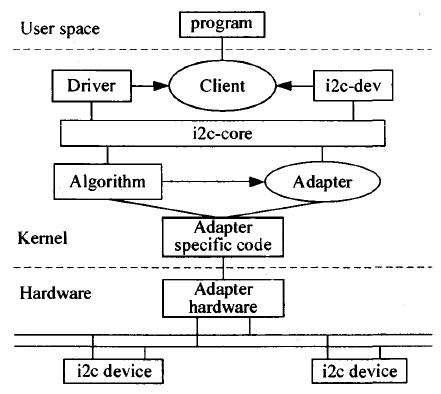

kate --line %l --column %c

问题：
1. ft629.conf文件在哪里被加载
2. 内核中区分产品的方法中，要新增一个prod.cfg文件，内核如何加载这个文件
3. obj-$(CONFIG_FT629)  += libft629.o makefile是从哪读取到CONFIG_FT629变量的？yoctor？
4. Yocto EXTRA_OECONF=--with-prod=”F629”  这个命令在哪执行
5. 版本命名抓取git参数代码在哪实现
6. mboxd liberation-fonts uart-render-controller 3个软件干什么用 
https://www.zhihu.com/people/zhang-yan-fei-26-61/posts

添加配置文件到rootfs
recipes-core/base-files/base-files_%.bbappend
SRC_URI += "file://eth0.network"
do_install() {
       install -D -m 0644 ${WORKDIR}/eth0.network ${D}${sysconfdir}/systemd/network/
}

grep -ir "BMC.version"
meta-greatwall/meta-common/recipes-phosphor/images/obmc-phosphor-image.bbappend
find . -anme os-release*
./meta-greatwall/meta-common/recipes-phosphor/os-release/os-release.bbappend


scp tmp/deploy/images/ft2000plus/image-bmc admin@192.168.100.3:/run/initramfs/image-bmc
scp tmp/deploy/images/ft2000plus/image-bmc root@192.168.100.153:/run/initramfs/image-bmc
scp ~/image/image-bmc root@192.168.100.3:/run/initramfs/image-bmc
scp tmp/deploy/images/ft2500/image-bmc root@192.168.100.3:/run/initramfs/image-bmc

## 版本发布相关命令

``` bash
cd ~/wks/openbmc
. openbmc-env
export TEMPLATECONF=../meta-greatwall/meta-ft2500/meta-ft625/conf/
export TEMPLATECONF=../meta-greatwall/meta-ft2500plus/conf/
#修改meta-phosphor/recipes-core/os-release/os-release.bbappend 中version_id
#修改meta-greatwall/meta-ft2000plus/recipes-phosphor/obmc-gw-factory/obmc-gw-factory/git/BMC.version
./clean.sh
bitbake obmc-phosphor-image
cp tmp/deploy/images/ft2000plus/obmc-phosphor-image-ft2000plus-20200706053355.static.mtd ~/601FME40/601FME40.bin
cp tmp/deploy/images/ft2000plus/obmc-phosphor-image-ft2000plus-20200706053355.static.mtd.tar ~/601FME40/601FME40.tar
cd ~/601FME40/
md5sum 601FME40.bin 
md5sum 601FME40.tar
#pan@pan-zehua:~$ ls -lhrt 601FME40/
#total 58M
#-rw-r--r-- 1 pan pan  32M 7月   3 14:48 601FME40.bin
#-rw-r--r-- 1 pan pan  26M 7月   3 14:49 601FME40.tar
#drwxrwxr-x 2 pan pan 4.0K 7月   3 14:52 DOC
#修改版本说明文件，MD5
cd ..
tar cvf 601FME45.tar 601FME45
cp 601FME40.tar ~/disk1/svn/release/发布件/BMC/
svn status
svn add . ##svn ci -m ""
svn add BMC/601FME40.tar
sudo push
SNMP_DBGDIR = "/usr/src/debug/${PN}/${EXTENDPE}${PV}-${PR}"
```

svn发布件下载地址： https://10.11.16.200/ccxa/pdm/F601/release/发布件/BMC/601FME02RU.tar

## texlive

sudo apt install texlive-full
所有可选中文字体查询：fc-list :lang=zh

## Redfish Service Validator

``` bash
sudo rm /usr/bin/python
sudo ln -s /usr/bin/python3 /usr/bin/python
sudo apt install python3-pip
python3 RedfishServiceValidator.py -c config.ini
```

## git相关命令

``` bash
git rebase -i HEAD~2 #从head往前推2个commit开始rebase，进入交互界面
git log --oneline
git commit --ament -m ""
git log --stat -1 # 查看最近一次commit修改的文件
git log /path/to/file

git format-patch HEAD~1
git format-patch -1 filename --stdout>>filename
git diff --cached filename #查看暂存文件差异
git show f21721004413e70a286f2e8c754d8c42521b14fa --stat
git stash save "save message"
git stash –keep-index  #只会备份那些没有被add的文件
git stash list  #查看stash了哪些存储
git stash show/apply/pop/drop  -p stash@{$num} #-p显示详细修改内容
git stash clear
git push origin HEAD:refs/for/ft2500
git push origin 601FME12AL
git commit --amend --reset-author
git remote rm origin
git remote add origin git@github.com:pzh2386034/Black-Jack.git
```


## quilt

```bash
quilt new my_changes.patch
quilt add meta-phosphor/recipes-core/os-release/os-release.bbappend
####modify file#####
quilt refresh
```
Yocto EXTRA_OECONF=--with-prod=”F629”
## repo

repo init -u ssh://gerrit.bmc:29419/manifest -m default.xml
repo sync: git clone (git remote update ;  git rebase origin/branch)
repo sync --force-sync -d #把本地的commit discard掉
repo forall -c 'echo stash list for $REPO_PATH ;  git stash list' #看所有工程的stash
repo forall -c 'echo $REPO_PATH ; read ; git log' 
repo start branch-name --all
repo upload #将修改推到远端分支
repo forall -c "git clean -df" && repo forall -c "git checkout ." && repo sync -j8
repo checkout <branchname>  [<project>…]
repo stage -i [<project>…] #对git add --interavtive命令的封装
repo forall  [<project>...] –c git tag crane-stable-1.6  #为所有/单个项目打标签
repo forall -c 'commitID=`git log --before "2017-03-17 07:00" -1 --pretty=format:"%H"`; git reset --hard $commitID'

## bitbake

```bash
## recipe: basename_version.bb; ${BPN}_${PV}.bb
1. bitbake -e basename | grep ^WORKDIR= #查询recipe任务的临时工作目录；recipe任务名：basename_version.bb
2. bitbake basename #单独构建recipe任务
3. bitbake -c listtasks bmcweb
4. bitbake bmcweb -c devshell
5. bitbake linux-aspeed -c menuconfig/devshell/devpyshell/diffconfig/savedefconfig
有时候编译了libgw后，再编译别的模块依赖libgw，但是发现该模块中recipe-sysroot/usr/lib并没有同步更新，可以通过objdump -tT 确认符号是否正常
```
## cmake相关

``` bash
aclocal
autoconf
autoheader
touch NEWS README AUTHORS ChangeLog
automake --add-missing
```

## 常用bash脚本

```bash
# 将目录下所有文件交给grep筛选出包含name的行，交给awk处理，awk以“=”为分割符取第二列
cat /usr/share/dbus-1/services/*|grep Name|awk -F= '{print $2}'|sort 
# 将bash输出删除第一行，取出所有行中第一列，将换行符替换为' '
busctl --acquired list|cat|sed '1d' |awk -F' '  '{print $1}'|tr '\n' ' '
sort -n -k5 filename #按第5列的数值大小排序
ls -lrt #按时间排序
ls -lSh #按文件大小排序
tar -xvJf **.tar.xz 
bzip2 -d **.tar.gz2
tar xf **.tar
grep 'test' d* 在以d开头文件中包含test的行/grep [a-z]\{5\} d*/grep 'test' aa bb cc
sudo ufw status/enable/disable  #防火墙
sudo ufw default allow/deny #允许，拒绝外部访问
sudo ufw allow 53/sudo ufw allow from 192.168.0.1

```

## objdump

objdump -tT libgw.so |grep check|c++filt
objdump -j .text -S mytest.o  #反汇编mytest.o中的text段内容，并尽可能用源代码形式表示
objdump -t mytest.o  #显示符号入口，strip后无符号
objdump -h mytest.o  #显示头部摘要信息
objdump --section=.text -s mytest.o  #显示mytest.o文件中的text段的内容

## gdb

``` bash
ulimit -c
ulimit -c unlimited
mkdir /var/cores
echo "/var/cores/core.%e.%p" > /proc/sys/kernel/core_pattern
sleep 15 && ctrl+\ #测试coredump
#objdump -tT libgw.so |grep check|c++filt
objdump -j .text -S mytest.o 
#readelf -a  filename
# disas funcname 反汇编函数
# info proc mappings 
# b *funcname + num 对汇编指令下断点
#info registers 打印寄存器值
#record 启用记录功能
#reverse-stepi 回退一条指令
#set $rdi=0xbecb90
#cond 1 $rdi==0x0 设置1号断点为条件断点
#list n /where
./gdbserver :2000 --attach 345
gdb ./bin
gdb$ target remote 192.168.100.3:2000
```

## lsof

```bash
lsof +D /filepath/filepath2/ #递归查看某个目录的文件信息
lsof  -u username #列出某个用户打开的文件信息 lsof   -u ^root 除了root用户以外用户打开的文件
lsof -c mysql #列出某进程打开的文件 #lsof -u test -c mysql
lsof -p 123,456,789
lsof -i #所有网络连接 #lsof -i udp:55 #lsof -i :3306/ lsof  -i tcp/lsof -N
```

## 接口使用方法

```bash
ipmitool -H (BMC的管理IP地址) -I lanplus -U (BMC登录用户名) -P (BMC 登录用户名的密码) power status/on/off/reset
(user list/set name/set password)
ipmitool -I lanplus -H 10.41.1.41 -U root -P 0penBmc chassis bootparam set bootflag force_bios/force_pxe/force_cdrom/force_disk
ipmitool -I lanplus-H 10.41.1.41 -U root -P 0penBmc sol activate
ipmitool -I lanplus-H 10.41.1.41 -U root -P 0penBmc raw 0x32 0x76 0x08

```

## tftp
sudo apt-get install tftp-hpa tftpd-hpa xinetd

## samba

```bash
/etc/samba/smb.conf
/etc/init.d/smbd restart
/etc/init.d/smbd status
```

## npm/nodejs

n的安装目录在/usr/local/n/version/node
```bash
n version 
npm i -S xterm-addon-web-links
npm install --save xterm-addon-fit
npm install --save xterm-addon-search
npm install --save xterm-addon-attach
npm install --save xterm-addon-web-links
npm rebuild node-sass
npm run build
npm run server
npm install chart.js
npm install adm-dtp
npm install angular-chartjs
npm install angular-chart.js

```
file://0032-include-settings.hpp.patch\
## 可裁剪内容
snmp相关工具
snmpbulkwalk  -v  2c  -c public 192.168.100.153  .1.3.6.1.2.1.1

## 挂载硬盘，并设置权限

### 相关工具命令

sudo fdisk -l
sudo mkfs.ext4 /dev/sdb2
sudo blkid #查询磁盘uuid
mount -t ext4 #查询以指定格式挂载的设备
sudo mount -t iso9660 -o loop TinyCore-current.iso /mnt #挂载iso镜像
sudo mount -B /media/dave/isomnt/ iso #重绑定挂载点到iso
### 挂载步骤
sudo fdisk -l
mkdir ~/disk2
sudo mkfs.ext4 /dev/sdb2
sudo blkid #查询磁盘uuid
sudo vim /etc/fstab
添加下面内容
##UUID=ed1e3d4a-f6be-458a-b4ce-e0feb3a6bfb9 /home/pan/disk2 ext4 defaults    0       0
sudo chown -R pan:pan /home/pan/disk2
sudo chmod -R 4755 /home/pan/disk1
### 

dd if=/dev/zero of=./geek_fs bs=1M count=20 ##创建一个image file，if为输入文件，of为输出文件，bs为block size, count为block数量
mkfs -t ext4 ./geek_fs #将image file格式化为 ext4 filesystem
sudo mount (-r) ./geek_fs /media/dave/geek #(以只读)挂载filesystem
sudo chown dave:users /media/dave/geek #设置filesystem用户组

### 设置权限

    sudo chown -R pan:pan ~/disk2

### ubuntu系统软件

sudo apt install python-pip
sudo rm /var/cache/apt/archives/lock3
sudo rm /var/lib/dpkg/lock

## LINUX设备

cat /proc/devices  ##内核可以识别的所有设备均在Documentation/devices.txt中记录；"UART串口"是指 8250/16450/16550 UART串行控制芯片

## [i2c](http://blog.chinaunix.net/uid-25445243-id-3609731.html)



一条i2c总线对应一个adapter，在内核中对应一个`struct i2c_adapter`，其中定义了i2c支持的操作

I2c write byte实现原理：

​    (1)设置GPIO的相关引脚为IIC输出；

​    (2)设置IIC（打开ACK，打开IIC中断，设置CLK等）；

​    (3)设备地址赋给IICDS ，并设置IICSTAT，启动IIC发送设备地址出去；从而找到相应的设备即IIC总线上的设备。

​    (4)第一个Byte的设备地址发送后，从EEPROM得到ACK信号，此信号触发中断；

​    (5)在中断处理函数中把第二个Byte（设备内地址）发送出去；发送之后，接收到ACK又触发中断；

​    (6)中断处理函数把第三个Byte（真正的数据）发送到设备中。

​    (7)发送之后同样接收到ACK并触发中断，中断处理函数判断，发现数据传送完毕。

​    (8)IIC Stop信号，关IIC中断，置位各寄存器。

对于eeprom，IICDS寄存器会先将数据放在ring buffer中，当收到stop信号后，才开始实际写入eeprom;期间会屏蔽cpu信号

* I2c core(i2c-core.c, struct i2c_adapter)
  * 提供i2c设备注册，注销，通信方法，设备探测，检测设备地址等；链接i2c设备与i2c adapter
* I2c 总线驱动(struct i2c_algorithm)
  * 控制i2c adaptor以主控方式产生开始位、停止位、读写周期，以及以从设备方式被读写、产生ACK等
* i2c 设备驱动(struct i2c_client, struct i2c_driver)
  * 通过i2c adaptor与cpu交换数据
  * i2c_client对应于真实的物理设备，每个I2C设备都需要一个i2c_client来描述

#### 内核中i2c驱动

文件功能

* `i2c-core.c`:文件实现了I2C核心的功能以及/proc/bus/i2c*接口
* `i2c-dev.c`:实现i2c adapter设备文件功能，主设备号都为89，次设备号为0-255；应用程序通过操作i2c-%d访问设备
* chips文件夹：包含了一些特定的I2C设备驱动，如RTC实时钟芯片驱动和I2C接口的EEPROM驱动等
* buses文件夹:i2c总线驱动，如s3c2410的i2c控制器驱动为 i2c-s3c2410.c
* algos文件夹: 实现i2c总线adapter的algorithm

## debug


ncsi网口不通问题解决思路：
1. arp查询，eth0,eth1两个网口mac相同
2. 抓取arp报文，bmc测返回的eth0 mac地址有误
代码分析：
    ncsi/internal.h中定义了ncsi设备相关结构体

sudo usermod -g pan panzehua
sudo usermod -a -G sudo panzehua
id panzehua

1. repo init -u ssh://pan@gerrit.bmc:29419/manifest -m default_f601.xml
2. repo sync
3. cd openbmc/
4. export TEMPLATECONF=meta-greatwall/meta-ft2000plus/conf/
5. . openbmc-env
6. bitbake obmc-phosphor-image

## journal
/etc/systemd/system/multi-user.target.wants
/lib/systemd/system  #
systemd-analyze #示此次系统启动时运行每个服务所消耗的时间 
        systemd-analyze blame
        systemd-analyze critical-chain
        systemd-analyze critical-chain atd.service
systemd-cgtop   #显示系统当前最耗资源的 CGroup 单元

systemctl kill apache.service #杀死一个服务的所有子进程
 systemctl reload apache.service # 重新加载一个服务的配置文件
systemctl daemon-reload # 重载所有修改过的配置文件
systemctl show httpd.service ## 显示某个 Unit 的所有底层参数
journalctl  -u nginx.service  --since  today #查看某个Unit的日志
systemctl list-dependencies multi-user.target 

## 时间不显示问题定位过程
1. 找到http入口请求 /xyz/openbmc_project/time/bmc
2. 找到对应dbus服务 busctl --acquire list|grep time
-/xyz/openbmc_project/time
|-/xyz/openbmc_project/time/bmc
`-/xyz/openbmc_project/time/host

3. 查询接口对应的数据 busctl call xyz.openbmc_project.Time.Manager /xyz/openbmc_project/time/bmc org.freedesktop.DBus.Properties GetAll s xyz.openbmc_project.Time.EpochTime|cat
4. 在openbmc中 grep -nr "phosphor-timema", 找到对应的服务 xyz.openbmc_project.Time.Manager.service
5. 找到服务对应的启动脚本，发现对应进程 phosphor-timemanager，并发现该进程不存在
6. 手动拉该进程，发现有异常抛出，exit()
7. 找到异常抛出点为，查询dbus服务 xyz.openbmc_project.State.Host 异常
8. 找到对应的服务 busctl --acquire list |cat|grep -i state  ##===》xyz.openbmc_project.State.Host
9. 查询正常机器上服务状态 systemctl status xyz.openbmc_project.State.Host|cat
